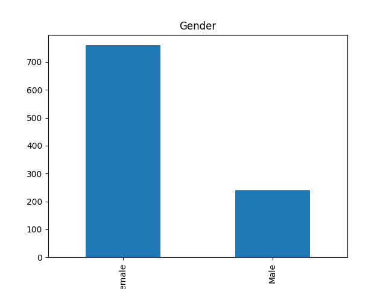
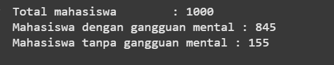
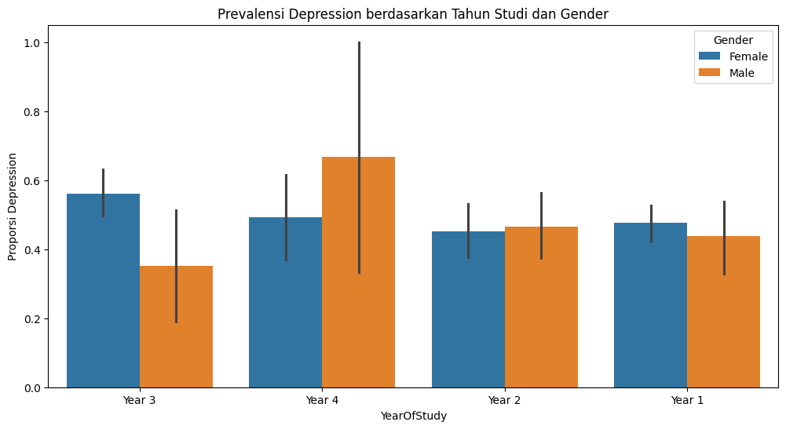

# Laporan Proyek Machine Learning - Khoirunnisa
---
## Project Overview

Kesehatan mental adalah kondisi kesejahteraan mental yang memungkinkan seseorang mengatasi tekanan hidup, menyadari kemampuan mereka, belajar dan bekerja dengan baik, serta berkontribusi pada komunitas mereka [1](https://www.who.int/news-room/fact-sheets/detail/mental-health-strengthening-our-response). Kondisi kesehatan mental meliputi gangguan mental dan disabilitas psikososial serta kondisi mental lainnya yang terkait dengan tekanan berat, gangguan fungsi, atau risiko melukai diri sendiri.

Berbagai penelitian menunjukkan bahwa mahasiswa dengan kesehatan mental yang baik cenderung memiliki nilai GPA yang lebih tinggi dibandingkan mereka yang mengalami masalah kesehatan mental seperti stres, kecemasan, dan depresi [2](https://jurnal.pnj.ac.id/index.php/JAP/article/download/6923/3330/23412#:~:text=mahasiswa%20dengan%20kondisi%20kesehatan%20mental%20yang%20buruk). Di lingkungan akademik, tekanan untuk mencapai prestasi yang tinggi, beban tugas yang berat, dan transisi kehidupan dapat mempengaruhi kesehatan mental mahasiswa secara signifikan.

Mengingat pentingnya kesehatan mental dalam kesuksesan akademik, diperlukan sistem yang dapat memprediksi tingkat kesehatan mental mahasiswa berdasarkan faktor-faktor yang dapat diidentifikasi. Dengan adanya prediksi ini, institusi pendidikan dapat memberikan intervensi dini dan dukungan yang tepat kepada mahasiswa yang membutuhkan.

---
## Business Understanding

### Problem Statements

Berdasarkan latar belakang yang telah dijelaskan, masalah yang dihadapi adalah sebagai berikut:

1. Algoritma machine learning manakah yang paling efektif untuk memprediksi tingkat kesehatan mental mahasiswa berdasarkan data demografis, akademis, dan behavioral yang tersedia?
2. Bagaimana cara mengevaluasi kualitas prediksi model dalam memprediksi skor kesehatan mental mahasiswa secara akurat?

### Goals

Untuk menjawab pernyataan masalah tersebut, tujuan proyek ini adalah:

1. Membangun dan membandingkan beberapa model machine learning (KNN dan AdaBoost Regressor) untuk prediksi tingkat kesehatan mental mahasiswa, kemudian memilih model terbaik berdasarkan performa evaluasi.
2. Mengimplementasikan metrik evaluasi yang tepat (Mean Squared Error) untuk mengukur akurasi prediksi dan menentukan model yang memberikan error terkecil.

### Solution Statements

Untuk mencapai tujuan proyek ini, diajukan dua pendekatan algoritma yang berbeda:

#### **Solusi 1: K-Nearest Neighbors (KNN) Regressor**
Algoritma KNN bekerja dengan mencari k tetangga terdekat dari suatu data dan mengambil rata-rata nilai dari tetangga tersebut sebagai hasil prediksi.

#### **Solusi 2: AdaBoost Regressor**
Algoritma boosting yang menggabungkan hasil dari beberapa model lemah secara sekuensial untuk meningkatkan akurasi prediksi.

---
## Data Understanding

Dataset yang digunakan berasal dari platform Kaggle dengan judul "Student Mental Health Survey", yang dapat diakses melalui tautan berikut: [Student Mental Health Survey](https://www.kaggle.com/datasets/shariful07/student-mental-health/data).

Data ini diperoleh dari survei yang dilakukan terhadap mahasiswa di International Islamic University Malaysia. Dataset terdiri dari **1000 baris** (observasi) dan **16 kolom** (variabel). Dataset diunggah ke Kaggle oleh MD Shariful Islam, seorang peneliti yang ingin memahami lebih lanjut tentang kesehatan mental mahasiswa.

### Variabel-variabel pada dataset adalah sebagai berikut:

| Nama Kolom | Deskripsi |
|------------|-----------|
| `Timestamp` | Waktu pengisian survei |
| `Gender` | Jenis kelamin responden (Female/Male) |
| `Age` | Usia responden (tahun) |
| `Course` | Jurusan atau program studi |
| `YearOfStudy` | Tahun studi (Year 1, Year 2, Year 3, Year 4) |
| `CGPA` | IPK terkini responden (skala 0-4) |
| `Depression` | Tingkat depresi (skala numerik) |
| `Anxiety` | Tingkat kecemasan (skala numerik) |
| `PanicAttack` | Riwayat serangan panik (0/1) |
| `SpecialistTreatment` | Pernah menjalani terapi dengan spesialis (0/1) |
| `SymptomFrequency_Last7Days` | Frekuensi gejala gangguan mental dalam seminggu terakhir |
| `HasMentalHealthSupport` | Mendapatkan dukungan untuk masalah kesehatan mental (0/1) |
| `SleepQuality` | Kualitas tidur (skala numerik) |
| `StudyStressLevel` | Tingkat stres akademik (skala numerik) |
| `StudyHoursPerWeek` | Rata-rata jam belajar per minggu |
| `AcademicEngagement` | Tingkat keterlibatan akademik (skala numerik) |
---
### Exploratory Data Analysis

#### 1. Analisis Univariat

-  Berdasarkan visualisasi distribusi gender pada dataset, mayoritas responden adalah perempuan (760 mahasiswa atau 76%), sedangkan laki-laki sebanyak 240 mahasiswa (24%). 

- Sebanyak 845 dari 1000 data mengalami sakit mental baik depresi, anxiety, dan panick attack.

#### 2. Analisis Multivariat

- Mahasiswa tahun ke-3 dan ke-4 memiliki tingkat depresi yang lebih tinggi dibandingkan tahun lainnya, kemungkinan disebabkan oleh tekanan akademik yang meningkat menjelang kelulusan. Perempuan cenderung mengalami tingkat depresi yang lebih tinggi dibandingkan laki-laki.
[visualisasi4](heatmap.png)
- Hasil analisis korelasi menunjukkan bahwa variabel `StudyHoursPerWeek` memiliki korelasi yang sangat kuat dengan `CGPA` (r = 0.93). Ini mengindikasikan bahwa semakin tinggi intensitas belajar mahasiswa per minggu, semakin tinggi pula nilai akademiknya.

---
## Data Preparation
Pada tahap ini dilakukan serangkaian proses untuk menyiapkan data agar siap digunakan dalam pelatihan model machine learning:

### 1. Feature Engineering
- **Pembuatan Target Variable**: Tiga kolom gejala mental (`Depression`, `Anxiety`, dan `PanicAttack`) dijumlahkan menjadi satu kolom baru bernama `MentalHealthScore`.
- **Alasan**: Menyederhanakan target prediksi dari klasifikasi per gejala menjadi satu nilai numerik yang merepresentasikan tingkat gangguan kesehatan mental secara keseluruhan.
- **Penghapusan Kolom**: Kolom `Timestamp` dihapus karena tidak relevan untuk prediksi.

### 2. Encoding Variabel Kategorik
- **Gender**: Female → 0, Male → 1
- **YearOfStudy**: Year 1 → 1, Year 2 → 2, Year 3 → 3, Year 4 → 4
- **Alasan**: Algoritma machine learning memerlukan input numerik untuk dapat memproses data kategorik.

### 3. Split Dataset
- Dataset dibagi menjadi data latih (80%) dan data uji (20%) menggunakan `train_test_split`.
- **Alasan**: Memastikan evaluasi model dilakukan pada data yang tidak pernah dilihat selama training untuk mengukur generalisasi model.

### 4. Frequency Encoding untuk Kolom Course
- Kolom `Course` memiliki banyak kategori unik, sehingga digunakan teknik frequency encoding.
- **Proses**: Mengganti nilai kategori dengan frekuensi relatif kemunculannya di data latih.
- **Alasan**: Teknik ini efektif untuk variabel kategorik dengan kardinalitas tinggi dan dapat memberikan informasi tentang prevalensi setiap kategori.

### 5. Normalisasi dengan MinMaxScaler
- Kolom numerik seperti `Age`, `CGPA`, dan `StudyHoursPerWeek` memiliki skala yang berbeda-beda.
- **Proses**: Menggunakan MinMaxScaler untuk menskalakan nilai menjadi rentang 0–1.
- **Alasan**: Mencegah bias model terhadap fitur dengan skala besar dan memastikan semua fitur berkontribusi secara seimbang dalam perhitungan jarak (terutama untuk KNN).

---
## Modeling

### K-Nearest Neighbors (KNN) Regressor

Model KNN diimplementasikan dengan parameter `n_neighbors=10`, yang berarti model akan mempertimbangkan 10 tetangga terdekat untuk membuat prediksi.

```python
knn = KNeighborsRegressor(n_neighbors=10)
knn.fit(X_train, y_train)
```

**Tahapan**:
1. Menghitung jarak euclidean antara data uji dengan semua data latih
2. Memilih 10 tetangga terdekat
3. Mengambil rata-rata nilai target dari 10 tetangga tersebut sebagai prediksi

- **Kelebihan**: 
  - Sederhana dan mudah dipahami
  - Efektif jika data memiliki struktur lokal yang kuat
  - Tidak memerlukan asumsi tentang distribusi data
- **Kekurangan**: 
  - Dapat menjadi lambat pada dataset besar
  - Sensitif terhadap curse of dimensionality
  - Memerlukan pemilihan nilai k yang optimal

### AdaBoost Regressor

Model AdaBoost diimplementasikan dengan parameter `learning_rate=0.05` dan `random_state=55`.

```python
boosting = AdaBoostRegressor(learning_rate=0.05, random_state=55)
boosting.fit(X_train, y_train)
```

**Tahapan**:
1. Membangun model regressor lemah pertama
2. Menghitung error dan memberikan bobot lebih tinggi pada sampel yang diprediksi salah
3. Membangun model regressor berikutnya dengan fokus pada sampel berbobot tinggi
4. Mengulangi proses hingga mencapai jumlah estimator yang ditentukan
5. Menggabungkan prediksi semua model dengan weighted voting
---
## Evaluation

- **Kelebihan**: 
  - Dapat menangani hubungan non-linear dalam dataset
  - Memberikan hasil yang stabil dan robust
  - Efektif pada data yang kompleks
- **Kekurangan**: 
  - Rentan terhadap overfitting jika tidak dilakukan tuning dengan baik
  - Lebih kompleks dalam interpretasi
  - Memerlukan tuning hyperparameter yang cermat

### Metrik Evaluasi

Evaluasi model menggunakan **Mean Squared Error (MSE)** yang menghitung rata-rata dari kuadrat selisih antara nilai prediksi dan nilai sebenarnya.

**Formula MSE**:
$$MSE = \frac{1}{n} \sum_{i=1}^{n} (y_i - \hat{y_i})^2$$

Dimana:
- n = jumlah dataset
- y_i = nilai sebenarnya
- ŷ_i = nilai prediksi

MSE dipilih karena:
- Memberikan penalti lebih besar untuk error yang besar
- Mudah diinterpretasikan dalam konteks regresi
- Sensitif terhadap outlier, yang penting dalam konteks kesehatan mental

### Hasil Evaluasi

| Model | Train MSE | Test MSE |
|-------|-----------|----------|
| KNN | 0.000762 | 0.000733 |
| AdaBoost | 0.000736 | 0.000713 |

### Analisis Hasil

Berdasarkan hasil evaluasi:

1. **Model Terbaik**: AdaBoost Regressor menunjukkan performa superior dengan MSE test sebesar 0.000713, lebih rendah dibandingkan KNN (0.000733).

2. **Konsistensi Model**: Kedua model menunjukkan konsistensi yang baik antara performa training dan testing, mengindikasikan tidak terjadi overfitting yang signifikan.

3. **Akurasi Prediksi**: MSE 0.000713 pada model AdaBoost menunjukkan error prediksi yang sangat rendah. Model mampu memprediksi skor kesehatan mental dengan deviasi standar sekitar ±0.027 dari nilai aktual.

4. **Practical Significance**: Dengan error yang sangat kecil, model dapat memberikan prediksi yang akurat untuk identifikasi dini mahasiswa yang memerlukan perhatian khusus terkait kesehatan mental.

## Kesimpulan

Proyek ini berhasil mengembangkan model prediksi kesehatan mental mahasiswa dengan akurasi tinggi. Model AdaBoost Regressor terpilih sebagai solusi terbaik karena memberikan error prediksi terkecil dan konsistensi yang baik. Model ini dapat diimplementasikan oleh institusi pendidikan untuk melakukan screening awal dan memberikan dukungan yang tepat sasaran kepada mahasiswa yang membutuhkan.

---

## Referensi

[1] World Health Organization. (2022). Mental health: strengthening our response. Diakses dari: https://www.who.int/news-room/fact-sheets/detail/mental-health-strengthening-our-response

[2] Zulfa, E., Amir, H., Ginting, R., & Sudarno, S. (2024). Analisis Korelasi Kesehatan Mental dan Indeks Prestasi Mahasiswa Jurusan Administrasi Niaga Politeknik Negeri Jakarta dengan Kombinasi Metode XGBoost dan SHAP. *Jurnal Administrasi Profesional*, 5(1), 26-37.

